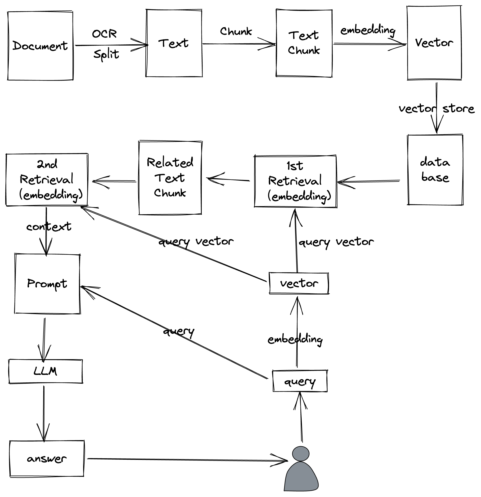
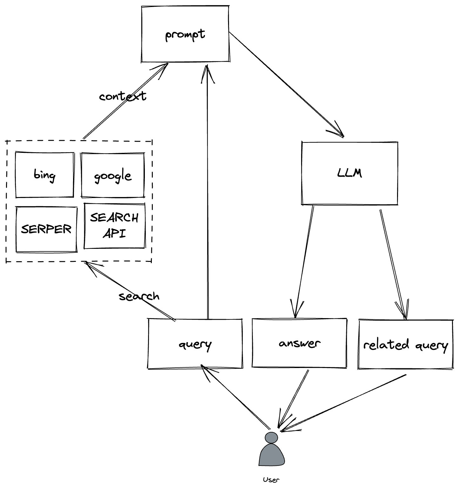
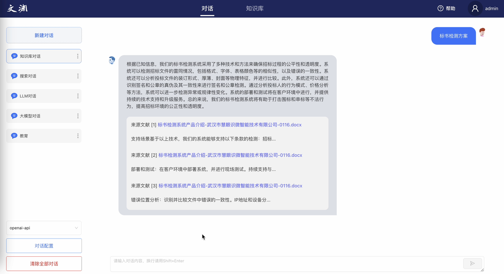
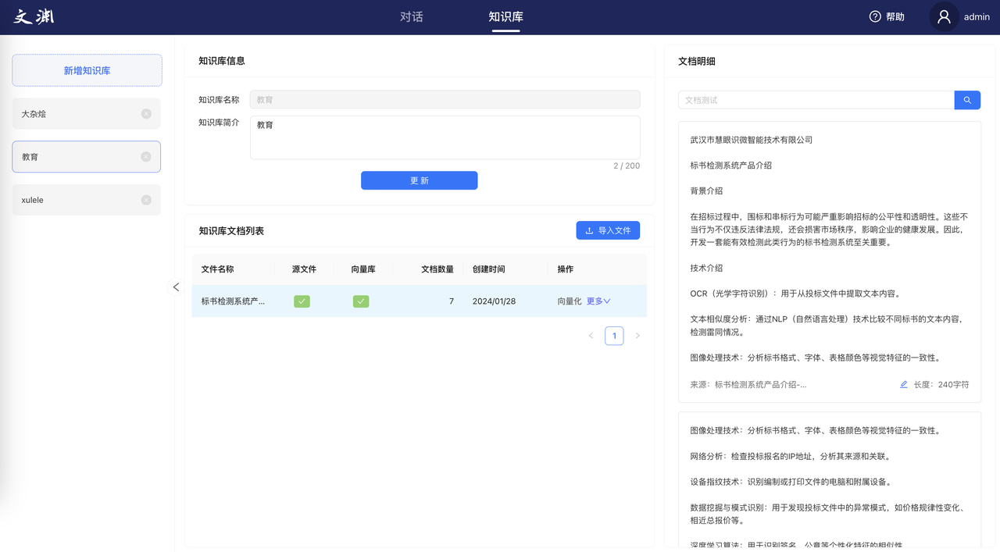
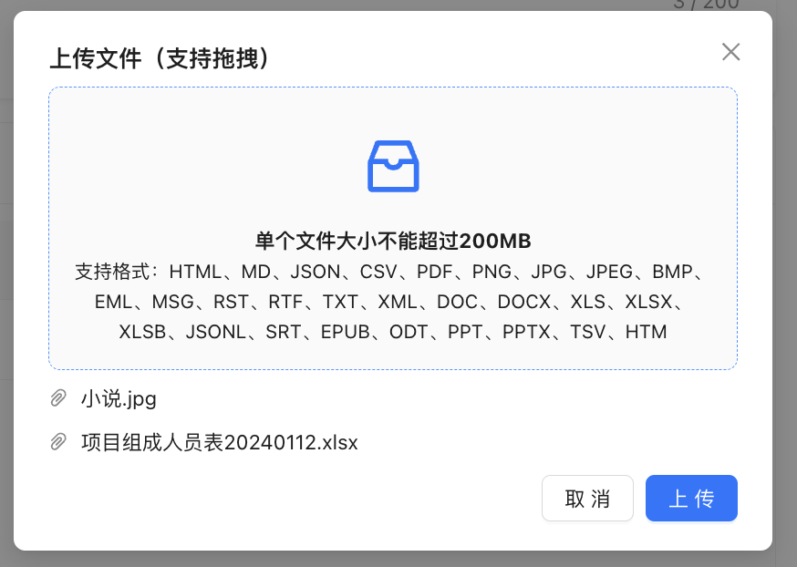

# 文渊

## 产品介绍
文渊 基于大模型检索增强生成式应用（RAG），目的降低大模型在实际使用场景的准入门槛，让所有人都能体验到大模型带来的生产效率的提升，本项目支持30+文件类型的导入问答，具有强大的兼容能力和适配能力

可快速应用至高校、教育、医疗、博物馆、建筑、客服等行业，解决专家知识平台建设和应用等问题
## 产品更新记录

### 版本优化V1.1-20240209
- 1、OCR识别优化
- 2、增加对话式搜索能力

### 版本优化V1.1-20240303
- 1、markdown格式支持
- 2、超链接跳转支持
- 3、图文结合回答支持
- 4、可以限制在知识库内回答

## 产品特性
1. 支持用户权限管理
2. 支持多知识库组合问答。
3. 支持纯知识库领域问答，也可支持知识库+LLM组合问答
4. 支持跨语种问答，中英文问答随意切换。
5. 强大的双语和跨语种语义表征能力
6. 性能扩展：支持多GPU部署
7. 支持大模型定制化微调
8. 支持企业私有化部署
9. 支持两阶段向量排序，有效优化大规模数据检索退化的问题
10. 高性能生产级系统，可直接部署企业应用。
11. 易用性，无需繁琐的配置，一键安装部署。
12. 文本内容快速纠错，所见即得
13. 支持文件对话、搜索对话、大模型对话
14. 支持接入主流的在线或离线的大模型服务
15. 兼容目前主流向量库：faiss、milvus、zilliz、pg，方便生产级扩展
16. 基于langchain框架研发，二开可快速集成官方的插件能力
17. 支持30+种文件类型导入，覆盖主流的业务场景

## 技术原理
- 检索原理

- 搜索对话

## 产品UI
- 对话

- 知识库管理

- 多文件格式支持

## 视频介绍

### 软件要求
- Python 3.10+
- CUDA 12.1+
- 科学上网环境（可选）

### 硬件要求：
#### 线上联网版
- LLM & embedding模型 都接线上服务
要求：
- CPU：intel I7 +
- 内存：32G
- linux环境
- 科学上网环境

#### 基础性能版
部署ChatGLM-6B,Baichaun-7B 这类小模型
要求：
- CPU：intel I7 +
- 内存：32G
- GPU：NVIDIA GeForce RTX：3080 Ti
- 显存：14G
- linux环境

#### 高性能版
部署Baichaun-13B 、Qwen-14B 大模型
要求：
- CPU：intel I7 +
- 内存：128G
- GPU：NVIDIA GeForce RTX：3080 Ti *2
- 显存：32G+
- linux环境

#### 高性能版Plus
部署Qwen-72B 超大模型
要求：
- CPU：intel I7 +
- 内存：256G
- GPU：NVIDIA GeForce RTX：3080 Ti * 6  /  A100*5
- 显存：160G+
- linux环境

## 联系方式

 
 

